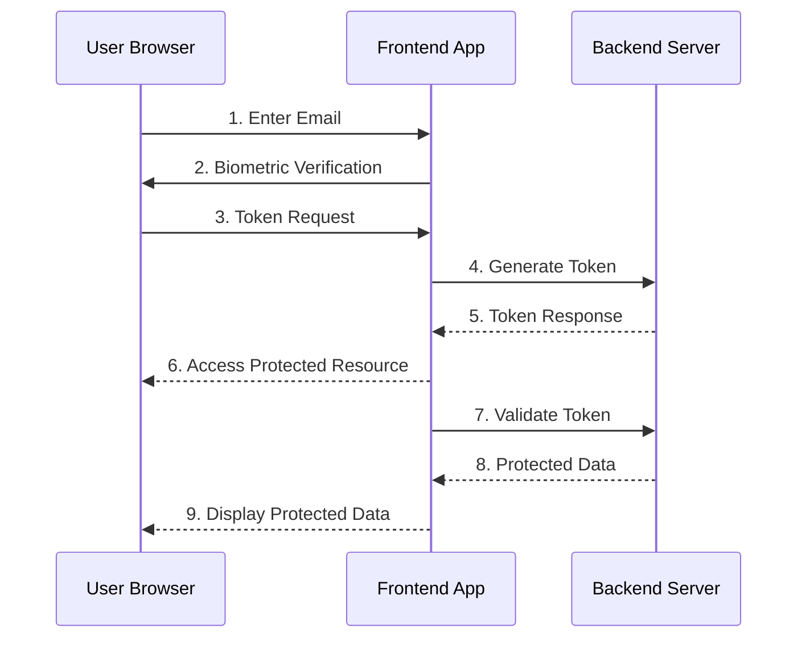

# Frontend for Device Authentication with Biometrics

This frontend application is part of a **Device Authentication System** that integrates with a backend to provide a secure email authentication flow with local device verification. The frontend handles user interaction, biometric verification, and communication with the backend to ensure only legitimate device owners can submit their email.

---

## Table of Contents

1. [Features](#features)
2. [Technologies Used](#technologies-used)
3. [Setup Instructions](#setup-instructions)
4. [Workflow](#workflow)
5. [API Integration](#api-integration)
6. [Biometric Verification](#biometric-verification)
7. [Project Structure](#project-structure)
8. [Running the Application](#running-the-application)

---

## Features

- **Email Input with Validation**: Users can enter their email address, which is validated using Zod.
- **Biometric Verification**: Integrates with the Web Authentication API to verify the user's biometrics (e.g., Touch ID, Face ID, Windows Hello).
- **Token Generation and Storage**: After successful biometric verification, a token is generated and stored in `localStorage` for future use.
- **Protected Resource Access**: Users can access protected resources only after successful biometric verification and token validation.
- **User Feedback**: Provides clear feedback through modals for success, errors, and instructions.

---

## Technologies Used

- **React**: A JavaScript library for building user interfaces.
- **React Hook Form**: For form management and validation.
- **Zod**: For schema validation of the email input.
- **Web Authentication API**: For biometric verification on supported devices.
- **TanStack Query (React Query)**: For managing server state and mutations.
- **Bootstrap**: For styling and modal components.
- **Lucide React**: For icons (e.g., loading spinner).

---

## Setup Instructions

### Prerequisites

- Node.js (v16 or higher) installed.
- A modern browser that supports the Web Authentication API (e.g., Chrome, Edge, Safari).

### Steps

1. **Clone the Repository**:

   ```bash
   git clone https://github.com/your-username/your-repo-name.git
   cd your-repo-name/frontend
   ```

2. **Install Dependencies**:

   ```bash
   npm install
   ```

3. **Run the Application**:

   ```bash
   npm start
   ```

   The application will start at `http://localhost:3000`.

---

## Workflow

### 1. **Email Input and Biometric Verification**

- The user enters their email address and clicks "Verify with Biometrics."
- The frontend triggers the Web Authentication API to verify the user's biometrics.
- If biometric verification is successful, the email and device ID are sent to the backend to generate a token.

### 2. **Token Storage**

- The token and its expiration time are stored in `localStorage` for future use.
- If the user revisits the page, the token is retrieved from `localStorage` and validated.

### 3. **Accessing Protected Resources**

- The user clicks "Access Protected Resource."
- The frontend checks for a valid token in `localStorage`.
- If the token is valid, the frontend calls the protected endpoint on the backend.
- The backend validates the token and device ID before granting access.

---

## API Integration

### Backend Endpoints

- **Base URL**: `http://0.0.0.0:8000`

#### 1. **Verify Email and Generate Token**

- **URL**: `/api/auth/verify`
- **Method**: `POST`
- **Request Body**:
  ```json
  {
    "email": "user@example.com",
    "device_id": "device123"
  }
  ```
- **Response**:
  ```json
  {
    "token": "generated_token_here",
    "expires_at": "2023-10-30T12:34:56.789Z"
  }
  ```

#### 2. **Access Protected Resource**

- **URL**: `/api/protected`
- **Method**: `GET`
- **Query Parameters**:
  - `token`: The token generated from the `/api/auth/verify` endpoint.
  - `device_id`: The device ID used during token generation.
- **Response**:
  ```json
  {
    "message": "You have accessed a protected resource!"
  }
  ```

---

## Biometric Verification

The frontend uses the **Web Authentication API** to verify the user's biometrics. This API is supported in modern browsers and allows for secure authentication using platform authenticators (e.g., Touch ID, Face ID, Windows Hello).

### Key Steps in Biometric Verification:

1. **Challenge Generation**: A random challenge is generated using `crypto.getRandomValues`.
2. **Credential Request**: The browser prompts the user for biometric verification using `navigator.credentials.get`.
3. **Verification**: If the biometric verification is successful, the frontend proceeds to generate a token with the backend.

---

## Project Structure

```
frontend/
│
├── src/
│   ├── lib/                   # Utility functions (e.g., webAuthn.ts)
│   ├── App.tsx                # Main application component
│   ├── Auth.tsx               # Authentication component
│   ├── index.tsx              # Entry point
│   └── ...                    # Other files
│
├── public/                    # Static assets
├── package.json               # Project dependencies
├── tsconfig.json              # TypeScript configuration
└── README.md                  # This file
```

---

## Running the Application

1. **Start the Backend**:

   - Ensure the backend is running at `http://0.0.0.0:8000`.

2. **Start the Frontend**:

   - Run `npm start` in the `frontend` directory.
   - The application will open in your browser at `http://localhost:3000`.

3. **Test the Flow**:
   - Enter an email address and click "Verify with Biometrics."
   - After successful verification, click "Access Protected Resource" to test the protected endpoint.

---

## Architecture Diagram


